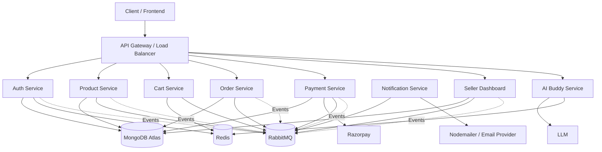

# VyaparX 🚀

### Scalable, Event-Driven E-Commerce Platform Built with Node.js Microservices


---

## 📌 Overview

**VyaparX** is a scalable, event-driven e-commerce backend built using a **microservices architecture**.

Instead of building the entire application as one monolithic backend, VyaparX separates business responsibilities into **8 independently deployable services**.

The system combines:

* ⚡ Node.js + Express
* 🗄️ MongoDB Atlas
* 🔎 MongoDB Atlas Search
* ⚡ Redis
* 📨 RabbitMQ
* 🤖 LangGraph-powered AI Buddy
* 💳 Razorpay
* 📧 Nodemailer
* 🐳 Docker
* 🔐 JWT + RBAC
* 📊 Seller analytics
* 🔄 Cross-service communication

The architecture is designed around **service independence, asynchronous communication, caching, fault isolation, and horizontal scalability**.

---

# 🏗️ System Architecture



---

# 🧩 Microservices

| Service                     | Responsibility                                                | Major Integrations             |
| --------------------------- | ------------------------------------------------------------- | ------------------------------ |
| 🔐 **Auth Service**         | Registration, login, JWT authentication, RBAC                 | MongoDB, Redis                 |
| 📦 **Product Service**      | Product CRUD, search, filtering, inventory-related operations | MongoDB Atlas Search, RabbitMQ |
| 🛒 **Cart Service**         | Cart management and calculations                              | Redis, RabbitMQ                |
| 📋 **Order Service**        | Order creation and lifecycle management                       | MongoDB, RabbitMQ, Payment     |
| 💳 **Payment Service**      | Payment creation, verification and webhook handling           | Razorpay, RabbitMQ             |
| 📧 **Notification Service** | Transactional emails and notifications                        | RabbitMQ, Nodemailer           |
| 📊 **Seller Dashboard**     | Sales metrics, stock alerts and seller analytics              | RabbitMQ, MongoDB              |
| 🤖 **AI Buddy Service**     | Conversational technical assistant                            | LangGraph, LLM                 |

---

# 🔐 Authentication & Authorization

VyaparX implements a secure authentication layer using **JWT-based authentication** combined with **role-based access control**.

### Authentication Flow

```text
User
 │
 ▼
Login / Register
 │
 ▼
Auth Service
 │
 ├── Verify credentials
 ├── Generate JWT
 └── Store required token state in Redis
 │
 ▼
Client
 │
 ▼
Protected Request
 │
 ▼
Authentication Middleware
 │
 ├── Verify JWT
 ├── Check token blacklist
 └── Attach authenticated user
 │
 ▼
Role-Based Middleware
 │
 ▼
Protected Controller
```

### Security Features

* JWT-based authentication
* Redis-backed token blacklisting
* Protected routes
* Role-based authorization
* Authentication middleware
* Authorization middleware
* Password hashing
* Request validation
* Secure service boundaries

Redis token blacklisting also allows invalidated tokens to be rejected after logout instead of relying solely on token expiration.

---

# 📨 Event-Driven Architecture

One of the core architectural decisions in VyaparX is the use of **RabbitMQ for asynchronous communication**.

Services don't need to directly depend on each other for every operation.

Instead, important actions can produce events that other services consume.

### Example

```text
Order Service
     │
     │ Order Created
     ▼
 RabbitMQ
     │
     ├──────────────► Payment Service
     │
     ├──────────────► Notification Service
     │
     └──────────────► Seller Dashboard
```

This reduces direct coupling between services and allows consumers to process events independently.

### Why RabbitMQ?

* Asynchronous processing
* Service decoupling
* Reliable message delivery
* Background workloads
* Event-driven analytics
* Cross-service communication
* Better fault isolation

---

# 📊 Seller Dashboard

VyaparX includes a dedicated **seller ecosystem** rather than treating sellers as ordinary users.

The Seller Dashboard consumes events from the system and provides useful business insights.

### Dashboard capabilities

* 📈 Sales metrics
* 📦 Products sold
* 🏆 Top-performing products
* ⚠️ Low-stock alerts
* 📊 Order analytics
* 💰 Seller-specific payment information
* 🔄 Event-driven metric updates
* 🛍️ Seller product information

### Seller Event Flow

```text
Order Created
     │
     ▼
RabbitMQ
     │
     ▼
Seller Dashboard Consumer
     │
     ├── Update order metrics
     ├── Update product sales
     ├── Check inventory
     └── Generate stock alerts
```

This keeps analytics processing separated from the main customer-facing request flow.

---

# 🔎 Intelligent Product Search

VyaparX uses **MongoDB Atlas Search** to provide a more powerful product discovery experience.

Instead of relying only on basic database queries, the Product Service supports:

* 🔍 Text-based product search
* ⚡ Fast search
* 🎯 Filtering
* 🏷️ Category-based filtering
* 💰 Price-based filtering
* 🔄 Combined search + filters

Example:

```text
Search:
"wireless headphones"

Filters:
Category → Electronics
Price → ₹1,000 - ₹5,000
Rating → 4+
```

The Product Service handles the search and filtering logic while MongoDB Atlas Search performs the underlying search operations.

---

# 🤖 AI Buddy

VyaparX also includes an **AI Buddy service built around LangGraph**.

The goal is not simply to expose an LLM API, but to create a structured conversational service capable of maintaining contextual state.

### AI Architecture

```text
User
 │
 ▼
AI Buddy Service
 │
 ▼
LangGraph
 │
 ├── Conversation State
 ├── Short-Term Memory
 ├── Agent Logic
 └── LLM
 │
 ▼
Contextual Response
```

### AI Buddy Features

* 🤖 Conversational technical assistant
* 🧠 Short-term conversational memory
* 🔄 Stateful LangGraph workflow
* 💬 Context-aware responses
* 🧩 Separate AI microservice
* 🔌 Independent LLM integration

Keeping AI as its own service means the rest of the marketplace doesn't need to directly depend on the AI implementation.

---

# 💳 Payment Architecture

Payments are handled by a dedicated **Payment Service** using Razorpay.

```text
Client
 │
 ▼
Order Service
 │
 ▼
Payment Service
 │
 ▼
Razorpay
 │
 ▼
Webhook
 │
 ▼
Payment Service
 │
 ▼
RabbitMQ
 │
 ├── Order Service
 ├── Notification Service
 └── Seller Dashboard
```

The dedicated Payment Service keeps payment-specific logic isolated from the Order Service.

---

# 📧 Notification System

Notifications are handled asynchronously.

Instead of making the main API request wait for an email to be sent:

```text
Business Event
      │
      ▼
   RabbitMQ
      │
      ▼
Notification Service
      │
      ▼
Nodemailer
      │
      ▼
   Email
```

This allows notification processing to remain independent from the main business transaction.

---

# ⚡ Redis Usage

Redis is used for performance-sensitive and short-lived data.

### Current Redis use cases

* 🔐 JWT token blacklisting
* 🛒 Cart data / fast cart access
* ⚡ Caching
* ⏱️ Temporary state
* 🤖 AI-related short-term state where applicable

Redis reduces unnecessary database operations for frequently accessed or temporary data.

---

# 🗄️ MongoDB Atlas

MongoDB serves as the primary persistent database layer.

It is used for storing application data such as:

* Users
* Products
* Orders
* Payments
* Seller information
* Dashboard data

MongoDB Atlas Search is additionally used for advanced product discovery.

---

# 🐳 Dockerized Architecture

Every microservice can be containerized independently.

```text
Docker
 │
 ├── Auth Container
 ├── Product Container
 ├── Cart Container
 ├── Order Container
 ├── Payment Container
 ├── Notification Container
 ├── Seller Dashboard Container
 └── AI Buddy Container
```

Docker provides:

* Consistent development environments
* Isolated services
* Reproducible builds
* Easier deployment
* Independent service packaging
* Simplified local infrastructure

---

# 🔄 Cross-Service Communication

VyaparX uses a combination of **synchronous and asynchronous communication**.

### Synchronous

Used when an immediate response is required.

```text
Client
  │
  ▼
Service A
  │
  ▼
Service B
  │
  ▼
Response
```

### Asynchronous

Used for events and background processing.

```text
Service A
   │
   ▼
RabbitMQ
   │
   ├── Service B
   ├── Service C
   └── Service D
```

This hybrid approach allows the architecture to remain responsive while moving non-critical workloads away from the request-response path.

---

# 🛡️ Scalability & Fault Isolation

The architecture is designed so individual services can scale independently.

For example:

```text
High Product Traffic
       │
       ▼
Scale Product Service
       │
       ├── Product Instance 1
       ├── Product Instance 2
       └── Product Instance 3
```

There is no requirement to scale every service just because one service experiences increased traffic.

### Benefits

* Independent deployment
* Independent scaling
* Fault isolation
* Smaller codebases
* Clear service ownership
* Easier maintenance
* Technology flexibility
* Better separation of concerns

---

# 🧠 Engineering Concepts Implemented

VyaparX goes beyond basic CRUD APIs and demonstrates several backend engineering concepts:

* Microservices architecture
* Event-driven architecture
* Message queues
* Asynchronous processing
* JWT authentication
* Redis token blacklisting
* Role-based authorization
* Database indexing/search
* MongoDB Atlas Search
* Caching
* Webhooks
* Payment gateway integration
* Cross-service communication
* Service-specific responsibilities
* AI agent workflows
* Stateful AI interactions
* Docker containerization
* Email notification pipelines
* Seller analytics
* Inventory alerts

---

# 🛠️ Tech Stack

## Backend

* Node.js
* Express.js
* JavaScript

## Database

* MongoDB
* MongoDB Atlas
* MongoDB Atlas Search

## Caching & Temporary State

* Redis

## Message Broker

* RabbitMQ

## Authentication

* JWT
* Redis
* Role-Based Access Control

## Payments

* Razorpay

## AI

* LangGraph
* LLM APIs

## Email

* Nodemailer

## DevOps

* Docker
* Docker Compose

---

# 🚀 Getting Started

## Prerequisites

Make sure you have installed:

* Node.js 18+
* npm
* Docker
* Docker Compose
* MongoDB Atlas account
* Redis
* RabbitMQ

---

## 1. Clone the Repository

```bash
git clone https://github.com/Ayushology/vyaparx.git
cd vyaparx
```

---

## 2. Configure Environment Variables

Create the required `.env` files for each microservice.

Typical variables include:

```env
MONGO_URI=
REDIS_URL=
RABBITMQ_URL=

JWT_SECRET=
JWT_EXPIRES_IN=

RAZORPAY_KEY_ID=
RAZORPAY_KEY_SECRET=

EMAIL_USER=
EMAIL_PASS=

LLM_API_KEY=
```

> Never commit secrets or production credentials to Git.

---

# 🐳 Running with Docker

Build and start the complete environment:

```bash
docker compose up --build
```

To run containers in the background:

```bash
docker compose up -d --build
```

To stop the environment:

```bash
docker compose down
```

---

# 💻 Running a Service Individually

Navigate into a service:

```bash
cd services/auth-service
```

Install dependencies:

```bash
npm install
```

Start the development server:

```bash
npm run dev
```
# 📁 Project Structure

```text
VyaparX/
│
├── auth-service/
│   └── src/
│       ├── broker/
│       ├── controllers/
│       ├── dao/
│       ├── db/
│       ├── middlewares/
│       ├── models/
│       ├── routes/
│       ├── services/
│       ├── validators/
│       └── app.js
│
├── product-service/
│   └── src/
│       ├── broker/
│       ├── controllers/
│       ├── dao/
│       ├── db/
│       ├── middlewares/
│       ├── models/
│       ├── routes/
│       ├── services/
│       ├── validators/
│       └── app.js
│
├── cart-service/
│   └── src/
│       ├── broker/
│       ├── controllers/
│       ├── dao/
│       ├── db/
│       ├── middlewares/
│       ├── models/
│       ├── routes/
│       ├── services/
│       ├── validators/
│       └── app.js
│
├── order-service/
│   └── src/
│       ├── broker/
│       ├── controllers/
│       ├── dao/
│       ├── db/
│       ├── middlewares/
│       ├── models/
│       ├── routes/
│       ├── services/
│       ├── validators/
│       └── app.js
│
├── payment-service/
│   └── src/
│       ├── broker/
│       ├── controllers/
│       ├── dao/
│       ├── db/
│       ├── middlewares/
│       ├── models/
│       ├── routes/
│       ├── services/
│       ├── validators/
│       └── app.js
│
├── notification-service/
│   └── src/
│       ├── broker/
│       ├── controllers/
│       ├── dao/
│       ├── db/
│       ├── middlewares/
│       ├── models/
│       ├── routes/
│       ├── services/
│       ├── validators/
│       └── app.js
│
├── seller-dashboard/
│   └── src/
│       ├── broker/
│       ├── controllers/
│       ├── dao/
│       ├── db/
│       ├── middlewares/
│       ├── models/
│       ├── routes/
│       ├── services/
│       ├── validators/
│       └── app.js
│
├── ai-buddy/
│   └── src/
│       ├── broker/
│       ├── controllers/
│       ├── dao/
│       ├── db/
│       ├── middlewares/
│       ├── models/
│       ├── routes/
│       ├── services/
│       ├── validators/
│       └── app.js
│
├── docker-compose.yml
└── README.md
```

# 🔭 Future Improvements

The architecture provides a foundation for further production-level improvements, including:

## Scalability

- API Gateway
- Centralized configuration management
- Horizontal autoscaling
- Kubernetes deployment

## Reliability

- Circuit breakers
- Retry strategies
- Dead-letter queues
- Service health monitoring

## Observability

- Distributed tracing
- OpenTelemetry
- Centralized logging
- Advanced observability dashboards

## Development & Deployment

- CI/CD pipelines
- Automated integration testing

---

# 🎯 What VyaparX Demonstrates

VyaparX was built to explore how a real-world e-commerce backend can evolve beyond a traditional monolithic architecture.

The project demonstrates practical implementation of:

- Authentication
- Authorization
- Caching
- Messaging
- Payments
- Search
- Notifications
- Analytics
- AI
- Containerization

while keeping each major responsibility isolated within its own service.

---

# 👨‍💻 Author

## Ayush Kumar

Backend Developer • B.Tech Undergraduate • DSA & System Design Enthusiast

**GitHub:** [@Ayushology](https://github.com/Ayushology)

---

# ⭐ Support

If you find **VyaparX** interesting or useful, consider giving the repository a ⭐.
```
